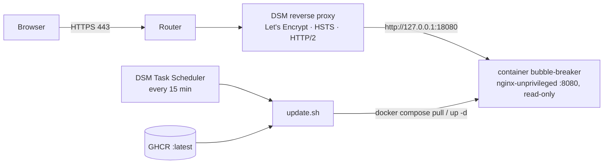

---
aliases:
  - Deployment & Operations
tags:
  - bubble-breaker/planning
  - bubble-breaker/phase-6
  - bubble-breaker/deployment
  - bubble-breaker/synology
status: accepted
created: 2026-09-27
---
# 06 — Deployment & Operations

Target: Synology DS224+ (x86-64), DSM 7.2+, Container Manager. Public internet on the user's own domain via the existing DSM reverse proxy. Image source: `ghcr.io/obichris11/bubble-breaker` (public, built by [05-cicd.md](05-cicd.md)).

The server is stateless: all player data lives in the browser (localStorage). Nothing on the NAS needs a backup except `compose.yml` and `update.sh`, and both are versioned in the repo under `deploy/`.

## Topology



## Image (`Dockerfile`, multi-stage)

| Stage | Base | Does |
|---|---|---|
| `build` | `node:24-alpine` (digest-pinned) | `npm ci` → `ng build --configuration production` |
| `runtime` | `nginxinc/nginx-unprivileged:<stable>-alpine` (digest-pinned) | Copies `dist/bubble-breaker/browser` and `nginx.conf`; runs as uid 101 on port **8080** |

- `HEALTHCHECK`: `wget -qO- http://127.0.0.1:8080/health || exit 1` (interval 30 s).
- OCI labels (`org.opencontainers.image.source/version/revision`) are set by CI.
- `.dockerignore` excludes `node_modules`, `dist`, `coverage`, `.git`, `docs`, `e2e`, `.angular`.
- Local check: `docker build -t bb . && docker run --rm -p 8080:8080 bb`.

## nginx (`nginx.conf`)

- `server_tokens off`. Access log goes to stdout, with `/health` excluded. Gzip is on for text types.

**Caching**

| Path | `Cache-Control` |
|---|---|
| `/index.html`, `/ngsw.json`, `/ngsw-worker.js`, `/safety-worker.js`, `/worker-basic.min.js`, `/manifest.webmanifest` | `no-cache` |
| Hashed bundles `*.[hash].js/css`, `/media/*`, fonts | `public, max-age=31536000, immutable` |
| Icons | `public, max-age=604800` |

**Routing**
- Known SPA routes (no file extension) → `try_files $uri /index.html`.
- A missing file with an extension (e.g. `/x.js`) → real **404**, never index.html.
- `/health` returns `200 ok`, `text/plain`.

**Security headers** (sent by the container; HSTS is set at the DSM proxy)
- `Content-Security-Policy`:
  - `default-src 'self'`
  - `script-src 'self'`
  - `style-src 'self' 'unsafe-inline'` (needed for Angular component styles)
  - `img-src 'self' data:`, `font-src 'self'`, `connect-src 'self'`
  - `worker-src 'self'`, `manifest-src 'self'`
  - `base-uri 'self'`, `form-action 'none'`, `frame-ancestors 'none'`
- `script-src 'self'` needs no inline scripts in `index.html`. Enable Angular `security.autoCsp`, or disable `inlineCritical`; verify in the e2e CSP test.
- Other headers:
  - `X-Content-Type-Options: nosniff`
  - `Referrer-Policy: no-referrer`
  - `Permissions-Policy: camera=(), microphone=(), geolocation=(), payment=(), usb=()`
  - `Cross-Origin-Opener-Policy: same-origin`
- CI `docker` job asserts these headers and the cache rules (see 05).

## Runtime (`deploy/compose.yml` on the NAS)

```yaml
services:
  bubble-breaker:
    image: ghcr.io/obichris11/bubble-breaker:latest   # pin X.Y.Z to roll back
    container_name: bubble-breaker
    restart: unless-stopped
    ports:
      - "127.0.0.1:18080:8080"      # only the DSM proxy can reach it
    read_only: true
    tmpfs:
      - /tmp
    cap_drop: [ALL]
    security_opt: [no-new-privileges:true]
    mem_limit: 64m
    pids_limit: 64
    logging:
      driver: json-file
      options: { max-size: "1m", max-file: "3" }
```

- The final writable paths for `nginx-unprivileged` (pid, temp dirs, all under `/tmp`) must be verified during implementation; add a tmpfs if needed.
- Host port 18080 is a placeholder; choose any free port.

## DSM configuration (one-time)

1. **Folder:** `/volume1/docker/bubble-breaker/` holding `compose.yml` and `update.sh` (copied from `deploy/`).
2. **Container Manager → Project → Create** from that folder. The project name must equal the folder name (`bubble-breaker`) so the UI and the CLI manage the same project.
3. **Certificate:** Control Panel → Security → Certificate → Let's Encrypt for `<game-domain>`. Assign it to the reverse-proxy entry.
4. **Reverse proxy:** Control Panel → Login Portal → Advanced → Reverse Proxy.
   - Source: `HTTPS`, `<game-domain>`, port 443; enable **HSTS** and HTTP/2.
   - Destination: `HTTP`, `localhost`, port 18080.
   - No websocket headers are needed.
5. **Router/DNS:** the domain already points at the NAS. Confirm 443 is forwarded, and that port 80 is reachable for the Let's Encrypt renewal (or use DNS challenge if DSM supports your provider).
6. **Remove legacy:** stop and delete the old `bubble-breaker` container, its image, and its reverse-proxy entry if the hostname changes. The old and new apps both use the Angular service worker at the same scope, so returning visitors update automatically. This relies on `ngsw.json` / `ngsw-worker.js` being `no-cache`.

## Updater (DSM Task Scheduler)

Control Panel → Task Scheduler → Create → Scheduled Task → User-defined script.
- User: `root`. Schedule: every 15 minutes.
- Run: `bash /volume1/docker/bubble-breaker/update.sh`.
- Notification: *"Send run details by email only when the script terminates abnormally"*.

`deploy/update.sh` (behavior):
1. `cd` to the folder, `set -euo pipefail`, take a `flock` so runs never overlap.
2. `docker compose pull -q`.
3. Compare the image ID before and after. If unchanged, exit 0 silently.
4. If changed:
   1. `docker compose up -d --remove-orphans`.
   2. Wait up to 60 s for the container health status `healthy`.
   3. If it never becomes healthy, **exit 1** (DSM emails the log).
   4. Otherwise prune old images of this repo only (`docker image prune -f --filter label=org.opencontainers.image.source=https://github.com/Obichris11/bubble-breaker`).
5. Append a one-line log (timestamp, old → new version label) to `update.log` and keep the last 500 lines.

On the NAS, verify the docker binary path (`/usr/local/bin/docker`) and that `docker compose` (v2) is available. DSM 7.2 Container Manager ships both.

The worst-case delay between a release and it being live is ~15 min plus the CI build time.

## Rollback

1. Edit `compose.yml`: change `image:` from `:latest` to the previous `:X.Y.Z`. The updater then keeps that pin, because it pulls whatever tag is configured.
2. Run the task manually (Task Scheduler → Run) or `bash update.sh`.
3. Fix forward via a new release, then set the tag back to `:latest`.

Clients: the service worker picks up the rolled-back version like any other update, via the "New version" toast.

## Monitoring

- The container `HEALTHCHECK` status is visible in Container Manager.
- The updater emails on failed deploys.
- Optional: an external uptime check on `https://<game-domain>/health` (e.g. an Uptime Kuma instance elsewhere, or a free hosted monitor). Not needed for v1.

## PWA deployment requirements

- HTTPS on the public hostname; the service worker requires it.
- The manifest has `name`, `short_name`, `start_url: "/"`, `scope: "/"`, `display: "standalone"`, and `theme_color` / `background_color` from the design tokens.
- Icons at 192 and 512 px, plus a 512 px maskable icon.
- `ngsw-config.json` uses asset groups only:
  - app shell + fonts: `prefetch`;
  - icons: `lazy`.

## Release checklist (manual, per release)

1. The release PR is green, then merge it.
2. The CI image job is green and Trivy is clean.
3. Within 15 min, check that `https://<game-domain>/` shows the new version on the About screen.
4. On a phone, the "New version" toast appears, reloading works, and the game in progress is preserved.
