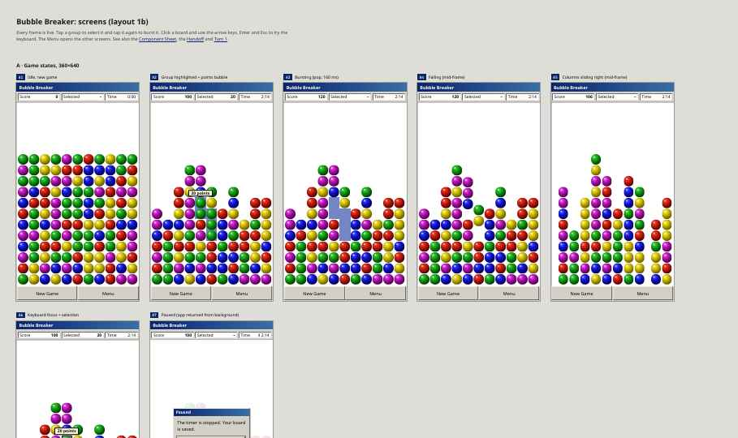
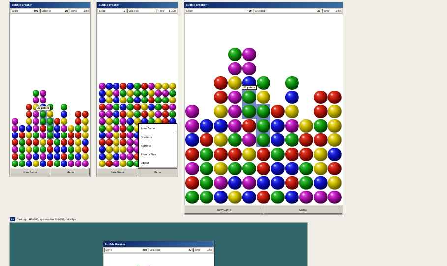

---
aliases:
  - Design handoff
  - Design index
tags:
  - bubble-breaker/design
  - bubble-breaker/index
created: 2026-09-27
---
# Design Handoff (Claude Design)

Exported from Claude Design. Binding decisions are summarized in [02-ux.md](../02-ux.md).

> [!NOTE]
> The `.dc.html` prototypes need `support.js` next to them and open in a browser, not in Obsidian. `tokens.css` is copied into the app verbatim.

| File | Content |
|---|---|
| [Handoff.dc.html](Handoff.dc.html) | Developer handoff: layout, interaction, motion, a11y, ball recipe |
| [Bubble Breaker Screens.dc.html](Bubble%20Breaker%20Screens.dc.html) | All screens and states |
| [Component Sheet.dc.html](Component%20Sheet.dc.html) | Chrome components, balls, patterns |
| [Game Screen.dc.html](Game%20Screen.dc.html) | Live reference prototype |
| [Game Screen Variations.dc.html](Game%20Screen%20Variations.dc.html) | Explored layout variations |
| [tokens.css](tokens.css) | Design tokens |

## Screenshots

